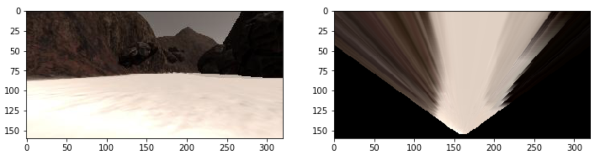
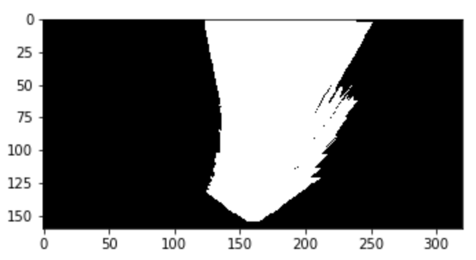
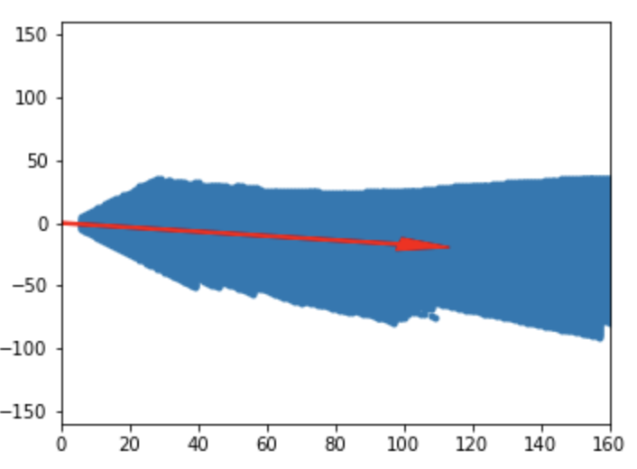
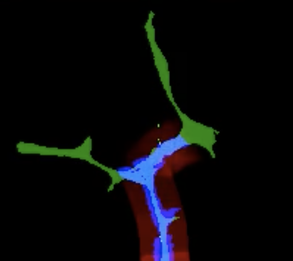

# **Search and Sample Return**

[](https://www.udacity.com/robotics)

## Overview

**The goals / steps of this project are the following:**  

**Training / Calibration**  

* Download the simulator and take data in "Training Mode"
* Test out the functions in the Jupyter Notebook provided
* Add functions to detect obstacles and samples of interest (golden rocks)
* Fill in the `process_image()` function with the appropriate image processing steps (perspective transform, color threshold etc.) to get from raw images to a map.  The `output_image` you create in this step should demonstrate that your mapping pipeline works.
* Use `moviepy` to process the images in your saved dataset with the `process_image()` function.  Include the video you produce as part of your submission.

**Autonomous Navigation / Mapping**

* Fill in the `perception_step()` function within the `perception.py` script with the appropriate image processing functions to create a map and update `Rover()` data (similar to what you did with `process_image()` in the notebook).
* Fill in the `decision_step()` function within the `decision.py` script with conditional statements that take into consideration the outputs of the `perception_step()` in deciding how to issue throttle, brake and steering commands.
* Iterate on your perception and decision function until your rover does a reasonable (need to define metric) job of navigating and mapping.  

## Project Details

### Notebook Analysis
#### Obstacle / rock sample detection
I first detected navigable terrain by applying color threshold. "obstacles" are actually all other than that, I just did the following.

```python
path_threshed = color_thresh(warped)  # detecting navigable terrain
obs_threshed = 1 - path_threshed  # detecting obstacles
rock_threshed = find_rocks(warped)  # detecting rock samples
```

For rock samples detection, I just tweaked the parameters for color threshold to detect yellow color.

```python
def color_thresh(img, rgb_thresh=(160, 160, 160)):
    color_select = np.zeros_like(img[:,:,0])
    above_thresh = (img[:,:,0] > rgb_thresh[0]) \
                & (img[:,:,1] > rgb_thresh[1]) \
                & (img[:,:,2] > rgb_thresh[2])
    color_select[above_thresh] = 1
    return color_select

def find_rocks(img, rgb_thresh=(110, 110, 50)):
    color_select = np.zeros_like(img[:,:,0])
    above_thresh = (img[:,:,0] > rgb_thresh[0]) \
                & (img[:,:,1] > rgb_thresh[1]) \
                & (img[:,:,2] < rgb_thresh[2])
    color_select[above_thresh] = 1
    return color_select
```

#### process_image()
I did the following flow. For code, please check the [jupyter notebook](./code/Rover_Project_Test_Notebook.ipynb).

1. Apply perspective transform


2. Apply color threshold to identify navigable terrain/obstacles/rock samples
<div></div>

3. Convert thresholded image pixel values to rover-centric coords
<div></div>

4. Convert rover-centric pixel values to world coords
5. Update worldmap
<div></div>


### Autonomous Navigation and Mapping
#### perception_step() and decision_step()
The `perception_step()` function follows the same flow as the `process_image()` function in jupyter notebook explained above.

The `decision_step()` function contains a lot of if-then-else conditions (like a decision tree!) to control the rover's actuations like steering, braking, accelerating.

#### Result and future work
The rover works reasonably well, exploring, navigating and mapping autonomously. The next job is to enable the rover to pick up and collect all of the rock samples.


#### Note
Resolution: 640×480, Graphics quality: Fastest, FPS: 35~38
